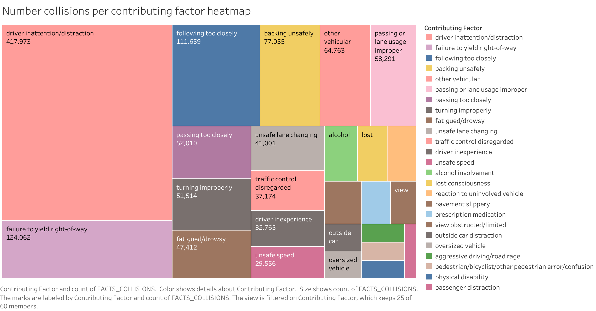

# Data-Warehouse-homework
## Intro

I decided to work on a NYC Data Collision Dataset because I want to get my drivers license soon and I thought it would be fun to explore different car crash statistics before I start driving.

The dataset is part of the NYC Opendata and it contains statistics on car crashes that happened in NYC. \
Link for the dataset is here: \
https://data.cityofnewyork.us/Public-Safety/Motor-Vehicle-Collisions-Crashes/h9gi-nx95/about_data

It is 2.08M rows and 29 columns. \
Link for the data dictionary: \
https://data.cityofnewyork.us/api/views/h9gi-nx95/files/bd7ab0b2-d48c-48c4-a0a5-590d31a3e120?download=true&filename=MVCollisionsDataDictionary_20190813_ERD.xlsx

## Part 1 - Data modelling

So to start I looked into the dataset dictionary to understand data and prepare for data warehouse modelling. \
I decided to start with facts and it was easy. Those were all quantifiable and aggrable columns. \
Else I separated into dimension tables of their own. \
You can see how I did it here:

Next step was to prepare schema. I used dbschema for this task. \
It looked like this.

That's how it looked when deployed for snowflake.

## Part 2 Setting up the cloud tools

After creating the model I proceeded to creating storage containers and a datawarehouse. I created a container in s3.\
I wanted to keep everything in AWS and I tried working with redshift, but it was not very convenient, so I decided to use snowflake.

I created an account and used the sql script from the dbschema dimensional model. \
Snowflake was very easy to use. (Compared to redshift and azure posgres)

## Part 3 ETL

After doing all the prerequisites, I could now proceed to working with the data.

First step was loading the data into s3 container. \
I used my extract.py script and had a keys.json file with my AWS account keys, to work with containers.

Next, I proceeded to transforming the data.
I used a lot of transformations on most of the columns, to greatly reduce the original dataset size. 

After this I started to work on loading the data into datawarehouse. \
I created dimension and fact tables from the dataset.

I used snowflake connector to python that greatly increased upload speed to the warehouse.

## Part 4 Connecting BI

After everything was inside the data warehouse I checked the tables to see their contents and how many rows did they have. \
I made sure everything was ok and proceeded to connecting Tableau to the warehouse. 

(I chose Tableau, because I had it on my laptop for a while and did not use it.)

## Part 5 Vizualizations

Finally I came to the part this whole project was about. I wanted to see more about car crashes statistics in NYC for my driving test and my future driving.

I asked myself multiple questions to which I hoped to find answers in this dataset.

1. What is the best weekday to take my driving test?

It looks like the best day to do my driving test is Sunday and the worst is Friday. 

2. What is the best month to take a driving test?

It does not seem like there is a big difference in which month I should take the test. \
October has the biggest collisions in the past few years, but not by much.

3. What is the safest borough to drive? (Could have been more accurate if I divided collisions by population maybe?)

To be honest that's not the best question to ask, but yes, Staten Island has the smallest number of collisions. \
I thought Manhattan is going to be higher in the list.

4. What is the unsafest location to drive in NYC(by zipcode)?

11207 has the highest collisions count and that's my zipcode too. \
No car till I move to a new place I guess. But now I know places where it's safer.

5. Where should you check the mirrors for cyclists the most(by zipcode)?

Yes, Williamsburg is the place where the most cyclists were hit by a car. \
I love Williamsburg and I love cycling. I'll try to not combine them.

6. What are the main factors that cause car collisions?

Driver inattention is the leading cause of car collisions, please try not to talk on your phone even if on a speaker. \
Being distracted makes the collision change the same as if you were drunk. \
Be careful and don't cause misery for your or someone elses closed ones.

7. Do the main factors causing collisions change in different seasons?

I am surprised that top 10 collision factors stay the same year round. \
I thought some weather related stuff will appear in winter, but nope.

8. I think that's it...

Thank you for reading this I hope it was as interesting for you to read \
as it was interesting for me to work on.

Se you soon.

